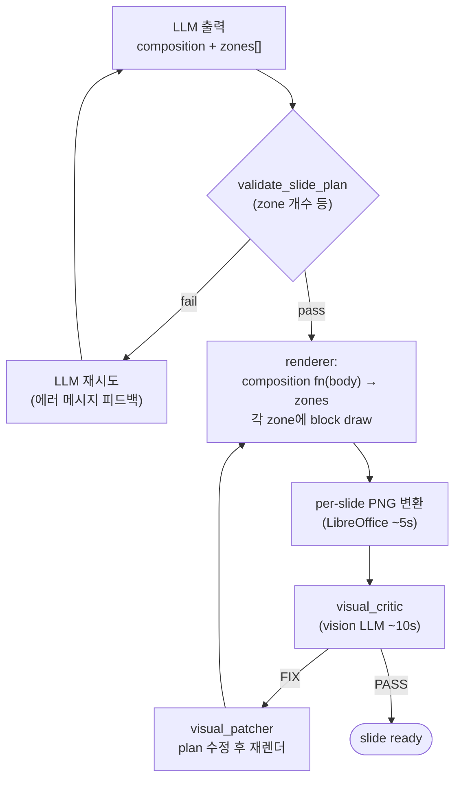
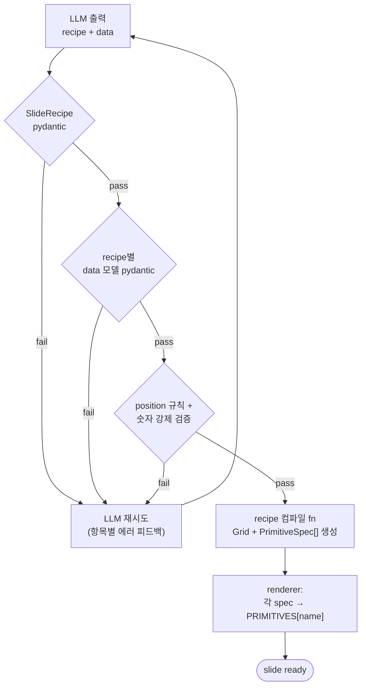
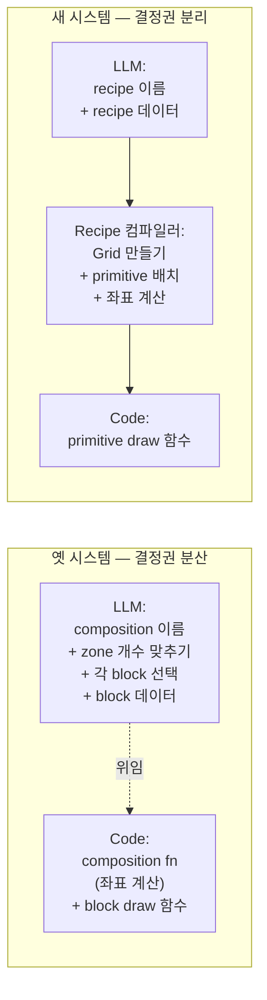
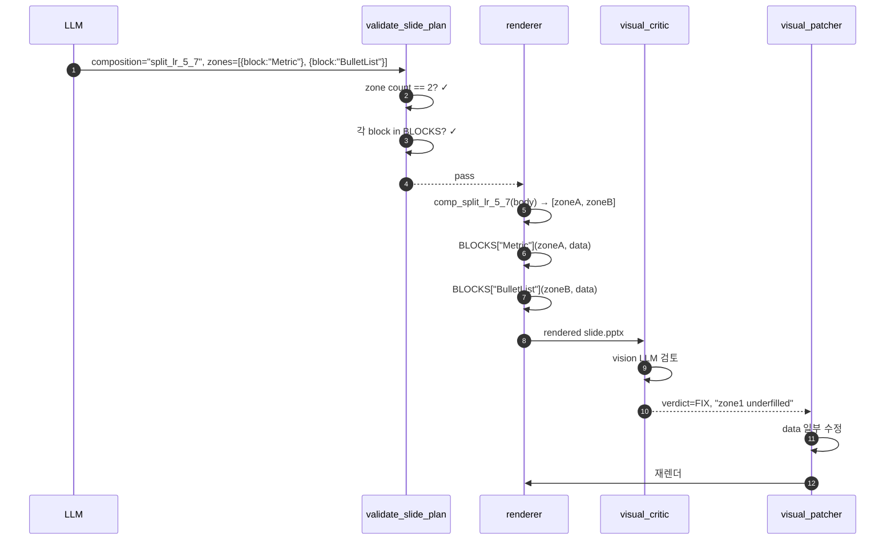
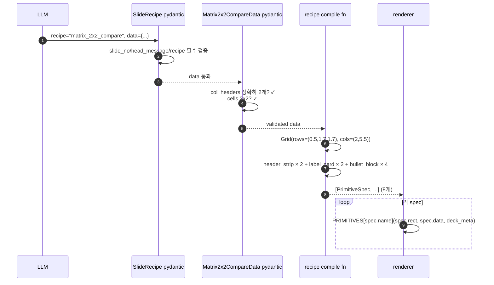

# 옛 구현 vs 새 구현 — PPTX를 만드는 메커니즘의 차이

날짜: 2026-05-04
대상: 시스템 전체 구조의 변화를 한 번에 이해하고 싶은 사람
관련 코드: `src/pipeline/`, `src/pptx/`, `prompts/slide_detail.md`

---

## TL;DR

| 항목 | 옛 시스템 (composition + block) | 새 시스템 (recipe + grid + primitive) |
|---|---|---|
| LLM이 결정하는 단위 | 레이아웃 enum + zone당 block + 데이터 | recipe 이름 + 데이터만 |
| LLM이 좌표를 만지나? | **간접적으로** — composition을 잘못 고르면 zone 좌표가 깨짐 | **0%** — 모든 좌표는 recipe 컴파일러가 결정 |
| 새 레이아웃 추가 비용 | enum + 가이드 + 카탈로그 + 검증 모두 수정 | recipe 함수 1개 + 카드 1줄 |
| LLM 실수의 종류 | "zone 4개 필요한데 2개만 만듦" | (해당 카테고리 자체가 사라짐) |
| 검증 시점 | 그린 뒤 visual critic이 후속 검사 | 그리기 전 pydantic이 거절 |
| 한 슬라이드 평균 처리 시간 | 렌더 + critic 2분 | 렌더 즉시 (critic은 deck당 1회) |

---

## 1. 슬라이드 한 장이 만들어지는 전체 흐름

### 옛 흐름



LLM이 한 슬라이드 출력을 만들면 **여러 단계의 사후 검사·수정 loop**가 돕니다. 가장 큰 비용 지출은 vision LLM 호출.

### 새 흐름



사후 critic이 사라지고, **그리기 전에 검증**이 모두 끝남. Vision LLM은 deck 단위로 1회만 (cross-slide 일관성 검사).

---

## 2. "메커니즘"의 핵심 — 누가 무엇을 결정하는가

이 비교가 가장 중요합니다. 결국 두 시스템의 차이는 **결정 권한이 누구한테 있는가**입니다.



**옛 시스템의 함정**: LLM이 "composition split_lr_5_7을 골랐고, 이건 zone 2개짜리이니까 zones 배열도 정확히 2개여야 한다"는 메타 지식을 매 호출마다 정확히 적용해야 합니다. 작은 모델(gemma4:e4b)은 이걸 자주 어깁니다.

**새 시스템의 안전장치**: LLM이 "recipe matrix_2x2_compare를 골랐다"고 말하면, zone 개수·좌표·primitive 배치는 **순수 함수**가 결정합니다. LLM이 zone 개수를 결정하는 능력 자체가 사라졌으므로 그 종류의 실수도 사라집니다.

---

## 3. 한 슬라이드의 실제 데이터 흐름 (matrix 예시)

### 옛 시스템



### 새 시스템



차이의 본질:
- 옛 시스템은 검증을 **단순 형식 체크**(zone 개수 맞나)만 하고, **시각적 결함**은 LLM 한 번 더 호출해서 잡았음.
- 새 시스템은 검증이 **데이터 의미**(col_headers 정확히 2개, cells 2x2 등)까지 들어가서, 시각적 결함이 발생할 가능성을 처음부터 막음.

---

## 4. 옛 시스템이 잘 안 됐던 구체 포인트

실제로 ai_era 풀 실행 로그에서 반복적으로 보였던 실패 패턴들:

### 4-1. composition vs zone 개수 불일치

```
[ 132.6s] ! slide_detail attempt 1: composition 'split_lr_5_7' expects 2 zones, got 4
[ 143.9s] ! slide_detail attempt 2: composition 'split_lr_6_6' is FORBIDDEN ...
[ 154.8s] ! slide_detail attempt 3: schema invalid ...
[ 154.8s] ! slide 4 detail unrecoverable; using full_canvas fallback
```

LLM이 "split_lr_5_7"라고 적어 놓고 zones 배열에는 4개(grid_2x2 데이터)를 넣음. 이게 **빈번하게** 발생. 3회 재시도 모두 다른 종류의 실수로 실패하면 fallback 슬라이드로 떨어졌음.

원인: LLM이 동시에 두 결정(composition 이름 + 그에 맞는 zone 수)을 일관되게 내야 했는데, 큰 deck에서는 일관성을 유지 못함.

### 4-2. 행/열 자유도 부족

옛 카탈로그에 행 분할 composition은 `split_tb_3_4` 1개뿐(그것도 50:50 고정). LLM이 시간 흐름이나 상하 구조를 표현하려고 해도 **선택지가 없음**. 그래서 모든 슬라이드가 split_lr_* 한 가지로만 그려져 단조로워짐.

forbidden-family 로직으로 split_lr을 막으면 grid_2x2 / single만 남아 더 단조로워지는 악순환.

### 4-3. 새 레이아웃 추가 비용이 너무 큼

매트릭스 한 장 추가하려면:
1. `compositions.py`에 새 composition 함수 추가
2. `_ZONE_COUNTS`에 zone 수 등록
3. `compositions.md` 카드 작성
4. `validate_slide_plan`이 알 수 있게 enum 업데이트
5. block 카탈로그 확장(필요시)
6. block draw 함수 추가
7. `slide_detail.md` 프롬프트에 예시 추가

7곳을 동기화. 한 곳만 빠뜨려도 LLM이 잘못된 출력을 만들거나 검증이 실패. 사용자가 "매트릭스 슬라이드 한 장 더 만들고 싶다"고 할 때마다 이 비용을 내야 했습니다.

### 4-4. visual critic의 비용 대비 효용

매 슬라이드마다:
- LibreOffice로 pptx → png 변환 (~5s)
- vision LLM 호출 (~10s)
- 결과가 FIX이면 patcher로 plan 수정 → 재렌더 (~5s)

6 슬라이드 deck → 약 2분 추가. 그런데 critic이 잡는 것의 대부분은 **opaque한 형식 결함** (zone underfill, swap_block) — 데이터 스키마 검증으로 충분히 사전 차단할 수 있는 것들.

### 4-5. 의미적 결함은 못 잡음

옛 검증은 "zone 2개인데 1개만 줬다" 같은 **형식 결함**만 잡았음. "head_message가 비어 있다", "BulletList items가 빈 배열이다" 같은 **의미 결함**은 그대로 통과. 결과적으로 빈 슬라이드가 deck에 섞여 들어가는 일이 발생.

---

## 5. 새 시스템이 어떻게 이 문제들을 구조적으로 푸는가

| 문제 | 옛 시스템의 처리 | 새 시스템의 처리 |
|---|---|---|
| zone 수 불일치 | LLM 재시도 (자주 또 실패) | **불가능** — LLM이 zone 수를 결정하지 않음 |
| 행 분할 부족 | enum에 행 split 추가 | recipe 함수만 추가 (1개 파일 수정) |
| 새 레이아웃 추가 | 7개 파일 동기화 | recipe 모듈 1개 + side-effect import |
| critic 비용 | 매 슬라이드 vision LLM | deck당 1회 vision LLM |
| 의미 결함 | 잡지 못함 → 빈 슬라이드 | pydantic이 거절 |
| 좌표 산수 실수 | LLM 재시도 | **불가능** — Grid 클래스가 담당 |

---

## 6. recipe + primitive가 정확히 무엇인가 (개념 정리)

### Recipe = 의미층 레이아웃 패턴

이름·데이터 스키마·컴파일 함수의 묶음.

```
recipe "matrix_2x2_compare":
  data 스키마 = {col_headers[2], row_labels[2], cells[2][2]}
  컴파일 fn = data + body Rect → [PrimitiveSpec, ...]
```

12개 등록: cover, thesis, single_bullets, split_bullets, matrix_2x2_compare,
headline_metric, kpi_dashboard_2x2, bar_compare_h, transformation_lr,
section_divider_strip, pull_quote, timeline_horizontal.

LLM이 만지는 단어. **"이 슬라이드는 어떤 의미 패턴인가"** 를 결정.

### Primitive = 시각 atom

Rect 한 개를 받아 슬라이드에 도형·텍스트를 그리는 작은 함수.

```
primitive "header_strip":
  data 스키마 = {text}
  draw fn = solid navy fill + 흰 글씨 가운데 정렬
```

13개 등록: header_strip, label_card, bullet_block, cover_card, thesis_card,
big_number, progress_bar, bar_compare, arrow_transform, section_band,
pull_quote, timeline_node, timeline_connector.

**LLM은 primitive 이름을 직접 적지 않습니다**. recipe 컴파일러가 어디에 어떤 primitive를 둘지 결정해서 spec에 박아 넣음.

### Grid = 좌표 계산 도구

container Rect + 행/열 가중치 + gutter를 받아 cell(r, c, rspan, cspan) 으로 sub-Rect를 돌려주는 클래스. recipe 컴파일러가 이걸 사용해 좌표를 만듭니다.

```python
g = Grid(body, row_heights=(0.5, 1.7, 1.7), col_widths=(2, 5, 5), gutter=0.1)
g.cell(0, 1)  # 첫 행, 두 번째 열의 Rect
```

LLM은 Grid를 모릅니다. 코드 내부 도구.

---

## 7. 한 줄 요약

> 옛 시스템은 **LLM에게 도면도 그리고 자르기도 시켰다**. LLM은 둘 중 하나를 자주 틀렸고, 사후에 검사관(visual critic)이 다시 자르라고 했다.
>
> 새 시스템은 **LLM에게 도면 종류만 고르게 하고**, 자르기는 코드(recipe 컴파일러)가 한다. 도면을 잘못 고르면 자르기 전에 거절(pydantic). 검사관은 마지막에 가구 한 세트인지만 본다(deck visual).

검증 책임을 "사후 탐지 → 사전 차단"으로 옮긴 것이 이 마이그레이션의 핵심입니다. 코드량은 늘었지만(recipe 함수들), LLM 실수와 vision LLM 호출 비용이 모두 줄었습니다.

---

## 8. 디렉터리 비교

| 옛 | 새 |
|---|---|
| `src/pptx/compositions.py` | `src/pipeline/recipes.py` (엔진) |
| `src/pptx/blocks.py` | `src/pptx/primitives.py` (PRIMITIVES dict) |
| `src/pipeline/zone_geometry.py` | (제거 — pydantic 데이터 모델이 흡수) |
| `src/pipeline/visual_patcher.py` | (제거 — 사후 패치 불필요) |
| `src/pipeline/text_critic.py` | (제거 — 사전 차단으로 흡수) |
| `src/pipeline/visual_critic.py` (per-slide) | (제거 — 같은 이유) |
| — | `src/pipeline/recipes_basic.py` (cover/thesis/single/split bullets) |
| — | `src/pipeline/recipes_matrix.py` (matrix_2x2_compare) |
| — | `src/pipeline/recipes_metrics.py` (headline_metric/kpi_2x2/bar) |
| — | `src/pipeline/recipes_narrative.py` (transformation/divider/quote/timeline) |
| `src/pipeline/critic.py` (plan critique) | `src/pipeline/critic.py` (deck-level만) |

`critique_deck_storyline`과 `critique_deck_visual`은 **유지**됩니다. 슬라이드 단위 검사는 사라졌지만, deck 전체의 흐름·일관성은 여전히 cross-slide 신호가 필요해서 vision LLM 1회 호출로 검사합니다.
