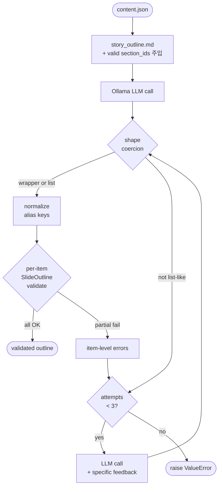
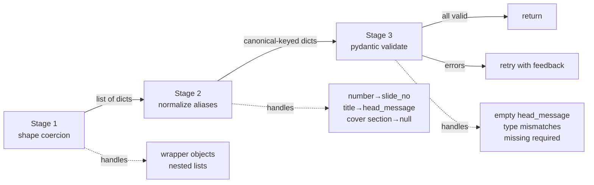

# Outline 견고성 — schema + normalization + retry

날짜: 2026-05-04
상태: 구현 완료
관련 코드: `src/pipeline/schemas.py`, `src/pipeline/planner.py`, `prompts/story_outline.md`

## 무엇을 바꿨는가

`generate_outline`의 출력 검증 파이프라인을 3단계로 재구성:

1. **Shape coercion** — `_coerce_to_outline_list` (기존, 유지). 리스트/래퍼 형태 흡수.
2. **Alias normalization** — `_normalize_outline_items` (신규). 키 이름 변형 흡수 + slide_no backfill.
3. **Per-item validation** — `SlideOutline` pydantic 모델 (신규). strict 검증 후 실패 항목별 피드백 누적.

3회 재시도 루프에서 실패 시 LLM에게 **항목별 구체 에러**를 피드백.

## 왜 이렇게 해야 했는가

### 발생한 구체 증상

```
[ 13.2s] + got 6 slides in outline
[ 19.9s] > LLM call: detail for slide 2
KeyError: 'slide_no'
```

20개 outline에서 일부 항목에 `slide_no` 키가 없어 detail 단계에서 즉사.
**outline 단계에서는 "리스트 모양"만 검증하고 항목 내부는 그대로 통과시켰던 것이
근본 원인.**

### 왜 LLM이 키를 빠뜨리는가

- `gemma4:e4b`는 9B 파라미터 모델. 50줄 가까운 객체 배열을 "전부 동일 키 셋"으로
  유지하는 능력이 약함 — 후반으로 갈수록 형식이 흔들린다.
- 특히 cover(slide_no=1)는 다른 슬라이드와 규칙이 살짝 다름(`section_id=null`)
  → LLM이 cover에서 형식을 다르게 처리하다가 키 자체를 빠뜨리는 패턴.
- format=json 모드는 **JSON 문법 유효성**만 강제할 뿐 **스키마 준수**는 보장 X.

### 두 단계 검증의 비대칭이 핵심 결함

| 단계 | 기존 검증 | 결과 |
|---|---|---|
| `generate_outline` | 리스트 모양만 | 항목별 누락이 silently 통과 |
| `generate_slide_detail` | pydantic SlideDetail + 재시도 루프 | self-healing |

같은 LLM 출력인데 한쪽은 견고하고 한쪽은 깨지기 쉬웠다. **방어선이 비대칭**이었던 것.

### 대안과 그 한계

| 대안 | 왜 부족한가 |
|---|---|
| **A. detail 단계에서 `outline.get('slide_no', '?')`로 방어** | 증상 가림. KeyError는 안 나지만 "slide_no=?"로 시작해 downstream 전체가 불일치. |
| **B. 프롬프트에 "엄격하게 키 셋 지켜라" 강조만 추가** | 같은 모델, 같은 길이 → 같은 실패. 검증 가능한 보장 0. |
| **C. `slide_no`만 array index로 강제 backfill (정규화만)** | 키 누락은 흡수하지만 LLM이 의미 필드(head_message 등)를 빠뜨려도 통과. 빈 슬라이드 양산. |
| **D. pydantic만 추가, 정규화 없이 strict** | 첫 시도부터 거의 항상 실패 → 매번 3회 재시도 비용. 키 이름 변형(예: `number`)은 영원히 못 살림. |
| **E. 본 설계 — 정규화 + strict pydantic + 항목별 피드백 retry** | 정규화로 1회 통과율 최대화, pydantic으로 의미 누락은 거부, retry 시 LLM에게 정확히 무엇이 잘못됐는지 알려줌. |

E를 선택한 이유: **각 단계가 다른 종류의 실패만 처리**한다.
- 정규화: 키 이름 변형(`number → slide_no`) 같은 **표면적 실수**.
- pydantic: 빈 head_message 같은 **의미적 결함**.
- retry: 재생성이 필요한 진짜 결함만 LLM 호출 비용을 씀.

세 층이 겹치지 않으면서 각자가 책임을 명확히 진다.

## 데이터 흐름



## 구현 핵심

### 책임 분리



### Alias normalization 정책 (planner.py)

```python
_OUTLINE_KEY_ALIASES = {
    "slide_no":     ("slide_no", "slide_number", "number", "no", "index", "idx"),
    "head_message": ("head_message", "message", "head", "title", "headline"),
    "purpose":      ("purpose", "role", "intent", "goal"),
    "section_id":   ("section_id", "section", "sec_id", "section_key"),
}
```

원칙:
- **slide_no는 array index로 backfill 가능** (의미 손상 없음).
- **head_message는 backfill하지 않음** (LLM이 의미를 안 줬는데 채워주면 거짓말).
- **section_id는 valid set 외 값이면 None으로 강등** (없는 섹션 만들지 않음).
- **첫 항목은 무조건 cover** (section_id=None 강제).

### SlideOutline 모델 (schemas.py)

```python
class SlideOutline(BaseModel):
    slide_no: int           # strict — 실패 시 retry
    head_message: str        # non-empty 강제
    purpose: str = ""        # 비어도 OK
    section_id: Optional[str] = None
```

검증자:
- `slide_no`: `"2"` 같은 문자열도 정수로 흡수, `bool`은 거부.
- `head_message`: 빈 문자열 거부 (LLM 게으름 방어).
- `section_id`: 빈 문자열 → None 정규화.

### Retry 피드백 형식

```
slide_no=5 field=head_message: Value error, head_message must be non-empty
slide_no=abc field=slide_no: Value error, slide_no must be an integer, got 'abc'
```

LLM이 항목 단위로 무엇을 고쳐야 하는지 정확히 알 수 있다. pydantic의
`ValidationError.errors()`에서 loc/msg를 꺼내 가공.

### 프롬프트 강화 (story_outline.md)

세 가지를 강제 명시:
1. **키 셋과 타입** ("EXACT keys, no aliases, no synonyms")
2. **valid section_ids 동적 주입** — content마다 다름:
   ```
   - `scale` — 변화의 규모
   - `daily` — 일상으로 들어온 AI
   ...
   ```
3. **3-슬라이드 미니 예시** — 키 형식이 LLM 머리에 박히도록.

## 예상 효과

| 효과 | 메커니즘 |
|---|---|
| **KeyError 종식** | pydantic이 detail 단계 진입 전 막음 |
| **silent corruption 종식** | head_message 누락은 fail-fast, fallback 가짜 데이터 생성 X |
| **section_id hallucination 차단** | LLM이 만든 가짜 ID는 normalize에서 None으로 강등 |
| **재시도 효율 ↑** | LLM이 항목별 정확한 피드백을 받음 → 무작위 재생성 X |
| **모델 교체 견고성** | 더 큰 모델(예: 26b)에서는 1회 통과율↑, 작은 모델에서는 retry로 자기복구 |

## 트레이드오프

- **재시도 비용**: ai_era 첫 실행에서 outline에 ~94초 (2회 재시도 + 성공 1회) 소요.
  단일 시도 대비 ~3배. 더 큰 모델로 교체 시 1회 통과율이 올라가면서 자연 해소될
  영역. 비용보다 견고성이 큰 가치.
- **strict pydantic이 LLM의 사소한 실수도 거부**: 의도된 행동. backfill을
  의미 필드까지 확장하면 빈 슬라이드가 deck에 섞여 들어옴. 거부하는 게 맞다.

## 검증

- `tests/test_renderer.py`: 4개 회귀 통과.
- `scripts/run_pipeline.py data/ai_era.json`:
  - outline 단계 통과 (1회 실패 → 2회 재시도 → 3회차 6 슬라이드 outline 확보)
  - KeyError 사라짐
  - detail 단계로 정상 진입

## 별도로 발견된 후속 이슈 (이번 작업과 무관)

detail 단계에서 `composition 'split_lr_5_7' expects 2 zones, got 4` 형태의 LLM
실수가 빈번. composition 이름과 zone 개수의 일치를 LLM이 자주 어김. 본질적
해소는 grid+recipe 도입(Phase 2~3)이 담당.
